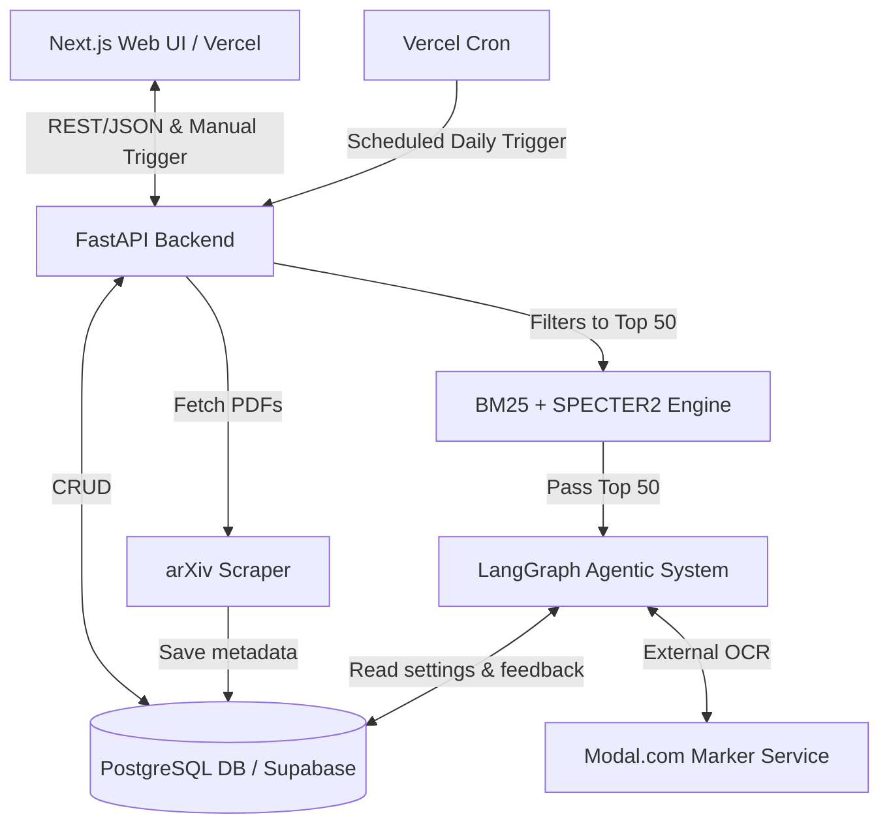

# AI-First System Specification
**Project:** Agent-based Information System for Personalized arXiv Publication Monitoring, Filtering and Recommendation.

*This specification is written for AI agents and developers to provide clear, unambiguous instructions on the system's architecture, data models, and logic flow.*

---

## 1. System Architecture Specification

The system is highly modular and API-driven, split into three main deployable subsystems plus a database.

### 1.1 High-Level Subsystems
1. **Frontend (Web UI)**: Built using **Next.js** and deployed on **Vercel**. It functions as the user-facing terminal and dashboard.
2. **Backend API & Pipeline**: **FastAPI** (Python). It handles the heavy lifting of PDF retrieval, document parsing (via `pypdfium` or Modal.com/`marker`), orchestrating LangGraph agents, and the retrieval engine.
3. **Database**: **PostgreSQL** (with `pgvector` for semantic search). A hosted service like **Supabase** is highly recommended here, as it pairs well with Next.js/Vercel and provides vector support natively.

### 1.2 Architecture Flow


---

## 2. Database Specification

**Recommended Database:** PostgreSQL with `pgvector`. 

### 2.1 Entity Relationship Model
```mermaid
erDiagram
    USERS ||--o| USER_SETTINGS : configures
    USERS ||--o{ FEEDBACK_MEMORY : generates
    USERS ||--o{ USER_PAPERS : interacts_with
    PAPERS ||--o{ USER_PAPERS : referenced_in

    USERS {
        uuid id PK
        string email
        string password_hash
        timestamp created_at
    }
    USER_SETTINGS {
        uuid user_id FK
        jsonb categories "['cs.AI', 'cs.LG']"
        jsonb topics "['agents', 'RAG']"
        jsonb authors "['Yann LeCun']"
        text filtering_goal "Detailed natural language goal"
        jsonb content_interest "['introduction', 'methodology', 'conclusions', 'experiments']"
        string library_explanation_level "professional | student | kid"
        string notification_time
        string pdf_parser_mode "pypdfium | marker-modal"
    }
    PAPERS {
        string id PK "arxiv_id"
        string title
        jsonb authors
        text abstract
        string pdf_url
        string source_url
        date published_at
    }
    USER_PAPERS {
        uuid id PK
        uuid user_id FK
        string paper_id FK
        string status "feed | accepted | rejected"
        float agent_score
        text agent_explanation
        text user_comment "Reason for rejection"
        timestamp created_at
    }
    FEEDBACK_MEMORY {
        uuid user_id PK / FK
        text summarized_feedback "LLM generated summary of all rejections"
        timestamp last_updated
    }
```

---

## 3. Web UI Specification

**Recommended Stack:** Next.js (Vercel deployment) + Tailwind CSS + React Query for data fetching.

### 3.1 Routing & Views
- **`/` (Landing Page)**: General app description, Auth.
- **`/terminal` (Settings Form)**:
  - Form fields: Categories, Authors, Topics.
  - NLP Goal: Detailed user goal `textarea`.
  - **Content Interest Extractor**: Multi-select indicating what parts of the paper matter to the user (e.g., Introduction, Methodology, Experiments, Conclusions).
  - **Parser Mode Toggle**: Testing toggle selecting `pypdfium` vs `marker` parsing scenarios.
  - Explanation Level (Professional, Student, Kid).
- **`/dashboard` (Feed)**:
  - **Pipeline Trigger**: A "Run Full Discovery Now" button for immediate testing, calling the FastAPI trigger endpoint.
  - Data structure: List of `USER_PAPERS` (`status == feed`).
  - Actions: `Thumbs Up` (Accept), `Thumbs Down` (Reject with reason comment modal).
- **`/library`**:
  - Contains accepted papers. Allows the user to ask for agentic "Explanations" derived from the selected section of the paper at their specific complexity level.

---

## 4. Scraping & Pre-processing Specification

### 4.1 Daily Scraper & Retrieval (The Funnel)
- **Invocation**: The process is triggered via a `/api/v1/trigger_discovery` FastAPI endpoint. In production, a Vercel Cron job or similar scheduler hits this endpoint at the specified time. For testing, it is hit manually from the Web UI.
- **Scraping**: Fetches new papers from arXiv matching the macro categories. Stores to DB.
- **Narrowing the funnel**:
  1. **Lexical Search (Okapi BM25)** against abstracts.
  2. **Semantic Search (SPECTER2)** against abstracts using `filtering_goal`.
  3. Combine ranks (RRF). Take the top ~50 papers and pass to the LangGraph pipeline.

---

## 5. Agentic System Specification

**Recommended Stack:** `LangChain` & `LangGraph` (FastAPI backend).

### 5.1 Deep Document Processing & Final Selection
The agentic system steps in once the pool is narrowed to the top 50, but we do NOT parse 50 PDFs to save compute out of the gate. 
1. **Top N Abstract Evaluation**: The Agent Evaluator node performs a fast evaluation on the 50 abstracts and distills it down to a final small candidate set (e.g., top 5-10 candidates).
2. **Deep System Scan**: For the final candidates, the full PDF is retrieved and parsed.

### 5.2 Agent Nodes
1. **Goal Distiller**: Translates NLP user goals into bulleted inclusion/exclusion constraints.
2. **PDF Extractor Node**: Fetches the selected PDF for the top 5-10 candidates. Dynamically branches into two testing scenarios based on `USER_SETTINGS`:
   - *Scenario A*: Parse locally using the python `pypdfium` library.
   - *Scenario B*: Offload to a Cloud Compute instance (Modal.com) running `marker` to extract highly structured text and the Table of Contents.
3. **Section Classifier LLM**: Scans the raw text or the TOC from the extractor. Identifies and slices the text into specific chunks (Introduction, Methodology, Experiments, Conclusions). Filters the document to present **ONLY** the sections defined in the user's `content_interest` array.
4. **Deep Evaluator (Agent)**: Given the focused text sections and the Distilled Goals, performs the final intensive evaluation.
5. **Critique**: Reviews the Deep Evaluator's trace against the User `feedback_memory`. Adjusts decision if it violates historical feedback.
6. **Explainer & Ranker**: Final approval assigns an `agent_explanation` and sorts the papers, queuing them for the Web UI endpoint.

---

## 6. Feedback Loop Specification

When a user rejects a paper on `/dashboard` with a comment:
1. Rejection reason is saved via REST.
2. The **Memory Summarizer Agent** parses existing `summarized_feedback` alongside the new comment and merges them into an updated, holistic "avoidance algorithm" logic.
3. This is injected as context for the `Critique` node in future daily runs.
